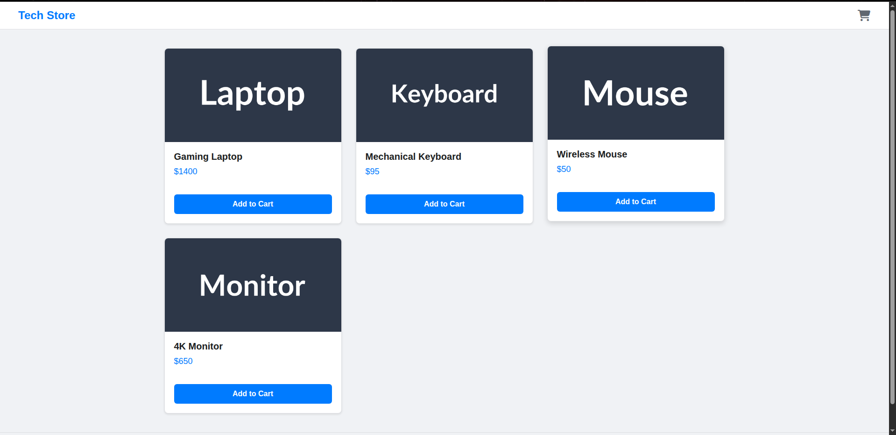

# Simple E-commerce Full Stack Deployment Project

This repository contains a complete, automated CI/CD pipeline for a simple Node.js web application. The project demonstrates modern DevOps practices, including Infrastructure as Code (IaC), containerization, automated testing, security scanning, and live monitoring.

## Live Application Screenshot

The following is a screenshot of the deployed e-commerce application running on an AWS EC2 instance.

## Core Technologies & Concepts

This project integrates several key technologies to achieve full automation from code commit to a live, monitored deployment.

*   **Source Control (GitHub):** The project is hosted on GitHub, with the `main` branch protected and used to trigger production deployment workflows.

*   **Infrastructure as Code (Terraform):** All required AWS resources, including the EC2 instance and its associated Security Group, are defined declaratively using Terraform. This allows for repeatable and version-controlled infrastructure setup.

*   **Containerization (Docker):** The Node.js application is containerized using a multi-stage `Dockerfile` to create a lightweight and portable production image. A `docker-compose.yml` is also included for easy local development.

*   **CI/CD (GitHub Actions):** A comprehensive GitHub Actions workflow automates the entire process:
    1.  **Test:** Runs unit tests with `npm test` on every push.
    2.  **Build & Push:** Builds the Docker image and pushes it to DockerHub.
    3.  **Scan:** Integrates **Trivy** to scan the new Docker image for `HIGH` and `CRITICAL` vulnerabilities before deployment.
    4.  **Deploy:** Securely connects to the EC2 server via SSH and deploys the new container, ensuring zero-downtime updates.

*   **Secret Management (GitHub Secrets):** All sensitive credentials, such as AWS keys, the DockerHub token, and the server's SSH key, are stored securely as encrypted secrets in GitHub and are never exposed in the code.

*   **Monitoring (Prometheus & Grafana):** A monitoring stack is deployed to the server using Docker Compose. Prometheus scrapes metrics from the server (via Node Exporter), and Grafana provides a dashboard to visualize server health, including CPU, memory, and disk usage.

## Setup & Deployment

Instructions on how to provision the infrastructure and trigger the deployment pipeline are detailed in the project's various configuration files (`.github/workflows/cicd.yml`, `terraform/main.tf`, etc.). The core steps involve:
1.  Configuring GitHub secrets.
2.  Running `terraform apply` to build the cloud environment.
3.  Pushing a commit to the `main` branch to trigger the CI/CD workflow.

## Cleanup

To avoid ongoing AWS charges, all provisioned resources can be destroyed by running `terraform destroy` from the `terraform` directory.